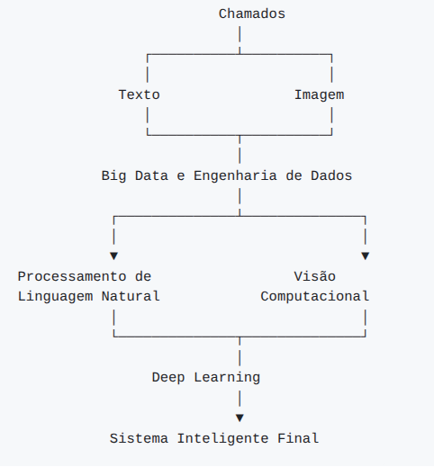

## Sobre o Projeto

O Projeto Integrador tem como objetivo agregar os conhecimentos desenvolvidos nas disciplinas da Pós-Graduação em Inteligência Artificial por meio da construção de uma solução baseada em Inteligência Artificial aplicada a um problema real de negócios.

Durante o semestre, os estudantes desenvolverão incrementalmente um **Sistema Inteligente Multimodal para Análise Automática de Chamados e Evidências**, explorando conceitos de *Big Data e Engenharia de Dados*, *Processamento de Linguagem Natural*, *Visão Computacional*, e *Deep Learning*.

Todo o desenvolvimento deverá ser realizado em equipes utilizando GitHub como ferramenta de gerenciamento do projeto.


|  |  |
|------------|---------|
| **Disciplina**: | Projeto Integrador II: Aplicação de Deep Learning |
| **Curso**: | Pós-Graduação em Inteligência Artificial |
| **Instituição**: | PUC-SP |
| **Carga horária**: | 40 horas |
| **Equipe**: | 1 a 4 alunos |
| **Repositório**: | Código versionado no GitHub |
| **Ferramentas**: | Python, Jupyter, TensorFlow, Scikit-learn |
| **Entrega final**: | Apresentação do projeto + código documentado |

---

## Objetivos

### Objetivos de Aprendizagem

Ao final do Projeto Integrador espera-se que os estudantes sejam capazes de:

1. Trabalhar em equipes utilizando GitHub para gestão do código fonte e também do projeto;
2. Desenvolver pipelines de Big Data e Engenharia de Dados;
3. Aplicar técnicas modernas de Processamento de Linguagem Natural;
4. Desenvolver modelos de Visão Computacional;
5. Construir modelos de Deep Learning;
6. Integrar diferentes modalidades de dados em um único sistema inteligente;
7. Documentar adequadamente um projeto de IA;
8. Apresentar tecnicamente uma solução completa.

### Objetivos Pedagógicos

Ao final do projeto espera-se que os estudantes sejam capazes de:

- Desenvolver soluções reais utilizando IA;
- Integrar diferentes áreas da Inteligência Artificial;
- Trabalhar colaborativamente em equipes;
- Organizar projetos utilizando Git e GitHub;
- Documentar adequadamente seus experimentos;
- Apresentar resultados técnicos de forma clara e objetiva.

---

## Disciplinas Envolvidas

| Sigla | Disciplina | Professor |
|-------|------------|-----------|
| **BD** | Big Data e Engenharia de Dados | Daniel Carvalho |
| **PLN** | Processamento de Linguagem Natural | Gabriel Santos |
| **VC** | Visão Computacional | Silvio Stanzani |
| **DL** | Fundamentos de Deep Learning | Daniel Barros |

---

## Tema do Projeto

### Contexto do Problema

Uma empresa nacional de suporte de TI atende centenas de clientes corporativos e recebe milhares de chamados técnicos todos os meses.

Cada chamado pode conter diferentes modalidades de informação, tais como:

- descrição textual do problema;
- imagens anexadas (prints de tela, fotografias ou mensagens de erro);
- informações do cliente;
- histórico de atendimentos anteriores;
- dados operacionais.

Atualmente, a triagem desses chamados é realizada manualmente por analistas especializados, que precisam interpretar as informações disponíveis, identificar o tipo de problema, definir sua prioridade e encaminhá-lo para a equipe responsável. Esse processo demanda tempo, é suscetível a inconsistências e impacta diretamente o tempo de atendimento ao cliente.

Neste Projeto Integrador, os estudantes deverão desenvolver uma solução baseada em Inteligência Artificial capaz de automatizar parte desse processo, utilizando técnicas modernas de Big Data e Engenharia de Dados, Processamento de Linguagem Natural, Visão Computacional e Deep Learning.

### Objetivos do Sistema Inteligente

Ao final do semestre, espera-se que cada grupo desenvolva um **Sistema Inteligente Multimodal** capaz de:

- compreender informações textuais presentes nos chamados;
- analisar imagens anexadas como evidências;
- integrar diferentes modalidades de dados (texto, imagem, histórico e informações do cliente);
- classificar automaticamente a categoria do chamado;
- predizer a prioridade do atendimento;
- estimar o tempo de resolução;
- identificar possíveis reincidências;
- sugerir a equipe responsável pelo atendimento;
- auxiliar o processo de triagem e tomada de decisão dos analistas.

### Problemas de Inteligência Artificial

Embora o sistema possa contemplar diferentes funcionalidades, o **objetivo principal** do Projeto Integrador será o desenvolvimento de um modelo capaz de **classificar automaticamente a categoria dos chamados**, utilizando múltiplas modalidades de dados.

As demais funcionalidades (predição de prioridade, estimativa do tempo de resolução, identificação de reincidências e sugestão da equipe responsável) representam extensões naturais da solução e poderão ser exploradas pelos grupos conforme a evolução do projeto e os conteúdos desenvolvidos nas disciplinas participantes.

---

## Arquitetura Geral


<!--

```text
                         Chamados
                           │
                ┌──────────┴──────────┐
                │                     │
             Texto                Imagem
                │                     │
                └──────────┬──────────┘
                           │
           Big Data e Engenharia de Dados
                           │
            ┌──────────────┴──────────────┐
            │                             │
            ▼                             ▼
 Processamento de                 Visão
 Linguagem Natural            Computacional
            │                             │
            └──────────────┬──────────────┘
                           │
                 Deep Learning
                           │
                           ▼
            Sistema Inteligente Final
```
-->

---

## Organização entre os Professores

Cada professor permanece responsável pelos conteúdos da sua disciplina.

O Projeto Integrador não substitui as disciplinas individuais, mas fornece um problema comum que será desenvolvido incrementalmente ao longo do semestre.

Espera-se que cada disciplina produza um componente que será incorporado ao sistema final.

Recomenda-se que os professores mantenham reuniões rápidas de alinhamento sempre que necessário para acompanhar a evolução dos grupos e garantir a integração entre as etapas.

---

## Cronograma

O Projeto Integrador será desenvolvido ao longo de **8 encontros remotos síncronos**, acompanhando a evolução das disciplinas participantes. A cada aula, os estudantes desenvolverão uma nova etapa da solução, construindo incrementalmente um **Sistema Inteligente Multimodal para Análise Automática de Chamados e Evidências**.

Todos os grupos utilizarão o **mesmo dataset oficial**, definido pelos professores no início do semestre.

### Cronograma das Aulas

| Data | Objetivo | Professor(es) | Marco | Notebook |
|:----------:|------------------|---------------|------------------|-------------------|
| **18/7** | Apresentar, formar grupos, dataset e ambiente | **BD** | Planejamento | **1_Exploracao** |
| **8/8** | Pipeline ETL (limpeza, transformação, partição) | **BD+DL** | Dados preparados | **2_Engenharia_Dados** |
| **22/8** | Primeiro modelo DL (MLP baseline) | **DL** | Modelo treinado | **3_Deep_Learning** |
| **5/9** | Módulo VC para imagens anexadas | **VC+DL** | VC concluído | **4_Visao_Computacional** |
| **19/9** | Módulo PLN para descrições textuais | **PLN** | PLN concluído | **5_PLN** |
| **3/10** | Integrar modelos de texto e imagem (multimodal) | **DL+PLN+VC** | Multimodal integrado | **6_Modelo_Multimodal** |
| **17/10** | Consolidar, pipeline de inferência, escalabilidade | **BD+DL** | Sistema integrado | **7_Pipeline_Final** |
| **31/10** | Apresentação final, demo e avaliação. | **Todos** | Projeto concluído | **Projeto_Final** |

### Entregas Esperadas

Cada notebook representa uma etapa incremental da construção da solução. Ao final do semestre, todos os notebooks deverão compor um único repositório GitHub organizado, documentado e reproduzível.

| Notebook | Objetivo | Competências | Conteúdo |
|----------|----------|----------------------------|-------------------|
| **1_Exploracao** | Planejar e compreender o problema. | Planejamento, trabalho em equipe, EDA e arquitetura. | Descrição, [dataset](/materiais/dataset/README.md), EDA, arquitetura inicial e planejamento. |
| **2_Engenharia_Dados** | Preparar dados para os modelos. | Engenharia de Dados, ETL e preparação. | Ingestão, limpeza, transformação, partição treino/validação/teste e documentação. |
| **3_Deep_Learning** | Desenvolver o primeiro modelo DL. | Redes neurais, treino supervisionado, avaliação. | MLP baseline, treino, ajuste de hiperparâmetros, avaliação e discussão. |
| **4_Visao_Computacional** | Desenvolver o módulo VC. | Processamento de imagens, CNNs, Transfer Learning. | Preparação das imagens, CNN/Transfer Learning, avaliação. |
| **5_PLN** | Desenvolver o módulo PLN. | Pré‑processamento de textos, embeddings, classificação. | Limpeza, embeddings, treino do modelo PLN, avaliação. |
| **6_Modelo_Multimodal** | Integrar texto e imagem em uma solução única. | Modelagem multimodal, fusão de embeddings, comparação. | Early/Late Fusion, treino multimodal, avaliação comparativa e discussão. |
| **7_Pipeline_Final** | Consolidar a solução do grupo. | Engenharia de IA, pipelines, documentação, implantação. | Pipeline de inferência, organização, documentação, avaliação final e limitações. |
| **Projeto_Final** | Apresentar e defender a solução. | Comunicação técnica, integração, colaboração, apresentação. | Repositório, notebooks, relatório técnico (2p), apresentação (15 min) e demo. |

---

## Produto Final

Cada grupo deverá entregar:

- Repositório GitHub organizado;
- Todos os notebooks desenvolvidos;
- Relatório técnico (até 2 páginas);
- Apresentação final (15 minutos);
- Demonstração da solução.

*Os entregáveis deverão ser disponibilizados no GitHub. O relatório técnico poderá ser apresentado em formato Markdown (.md) ou Notebook (.ipynb), não sendo necessária a entrega em DOCX ou PPTX.*


---

## Critérios de Avaliação

| Critério | Disciplina Relacionada | Peso |
|----------|------------------------|:----:|
| Pipeline de Big Data e Engenharia de Dados | BD | 15% |
| Modelo de Deep Learning | DL | 20% |
| Modelo de Processamento de Linguagem Natural | PLN | 15% |
| Modelo de Visão Computacional | VC | 15% |
| Modelo Multimodal Integrado | Transversal | 20% |
| Organização do GitHub e Documentação | Transversal | 5% |
| Relatório Técnico | Transversal | 5% |
| Apresentação oral e defesa do Projeto | Transversal | 5% |
| **Total** | | **100%** |

### Nota mínima para aprovação

De acordo com o regulamento do curso, o aluno deverá obter nota mínima de 7,0 (sete) no Projeto Integrador para aprovação no Módulo II. Frequência mínima exigida: 75%.

---

## Tecnologias Sugeridas

- Git
- GitHub
- Google Colab
- Python
- Jupyter Notebook
- Pandas
- NumPy
- Scikit-Learn
- TensorFlow
- Hugging Face Transformers
- OpenCV
- SQL
- Apache Spark
- PySpark

---

## Estrutura Esperada dos Repositórios dos Grupos

```
grupo-XX/
├── README.md
├── notebooks/
│   ├── 01_Exploracao.ipynb
│   ├── 02_Engenharia_Dados.ipynb
│   ├── 03_Deep_Learning.ipynb
│   ├── 04_Visao_Computacional.ipynb
│   ├── 05_PLN.ipynb
│   ├── 06_Modelo_Multimodal.ipynb
│   └── 07_Pipeline_Final.ipynb
│   └── Projeto_Final.ipynb
├── models/
├── reports/
├── presentation/
├── src/
│   ├── data_loader.py
│   ├── preprocessing.py
│   ├── models.py
│   └── utils.py
├── requirements.txt
└── .gitignore
```
---

## Organização do Projeto

Cada grupo deverá utilizar GitHub durante todo o desenvolvimento.

Recomenda-se:

- Utilização de Issues para gerenciamento de tarefas;
- Utilização de Pull Requests para revisão de código;
- Commits frequentes com mensagens descritivas;
- Documentação contínua do progresso;
- Versionamento adequado dos notebooks.

---

## Considerações Finais e Ética

O desenvolvimento deste projeto deve considerar aspectos éticos importantes:

**Privacidade**: Serão utilizados exclusivamente dados sintéticos ou anonimizados. Nenhum dado pessoal ou sensível será processado.

**Viés algorítmico**: Os modelos serão avaliados quanto a possíveis vieses que possam impactar negativamente grupos específicos.

**Transparência**: Todo o código, dados e metodologia estarão disponíveis publicamente no GitHub, garantindo reprodutibilidade.

**Finalidade**: O projeto tem fins exclusivamente acadêmicos e visa contribuir para o aprendizado e desenvolvimento de habilidades em IA.

---

## FAQ

Podemos utilizar TensorFlow? **Sim**.

Podemos utilizar PyTorch? **Sim, mas preferencialmente use o TensorFlow**.

Podemos utilizar outros modelos além dos apresentados em aula? **Sim, desde que devidamente documentados.**

Podemos utilizar bibliotecas adicionais? **Sim.**

Podemos utilizar Inteligência Artificial Generativa? **Sim, desde que o uso seja informado e documentado no relatório técnico.**

Podemos utilizar outro dataset? **Sim. É permitido utilizar um dataset diferente, desde que seja baseado no dataset oficial disponibilizado pelos professores, preservando seu contexto e estrutura para atender aos objetivos do projeto.**

---

## Referências Bibliográficas

ZHANG, Aston et al. Dive into Deep Learning. 2024. Disponível em: https://d2l.ai/index.html. Acesso em: 17 set.2025.

CHOLLET, François. Deep Learning with Python. Greenwich: Manning Publications, 2018.

BIRD, Steven; KLEIN, Ewan; LOPER, Edward. Natural Language Processing with Python. Sebastopol: O’Reilly
Media, 2009.

SILGE, Julia; ROBINSON, David. Text Mining with R. Sebastopol: O’Reilly Media, 2017.

FORSYTH, David A.; PONCE, Jean. Computer Vision: A Modern Approach. 2. ed. Boston: Pearson, 2011.

SZELISKI, Richard. Computer Vision: Algorithms and Applications. New York: Springer, 2010.

CHAMBERS, Bill; ZAHARIA, Matei. Spark: The Definitive Guide: Big Data Processing Made Simple. Sebastopol:
O’Reilly Media, 2018.

LAKSHMANAN, Valliappa; ROBINSON, Sara; MUNN, Michael. Machine Learning Design Patterns: Solutions to
Common Challenges in Machine Learning. Sebastopol: O’Reilly Media, 2020.

TREVEIL, Mark et al. Introducing MLOps: How to Scale Machine Learning in the Enterprise. Sebastopol: O’Reilly
Media, 2020.

GÉRON, Aurélien. Hands-On Machine Learning with Scikit-Learn, Keras & TensorFlow. 2. ed. Sebastopol:
O’Reilly Media, 2019.

ROSEBROCK, Adrian. Deep Learning for Computer Vision with Python. PyImageSearch, 2017.

---
