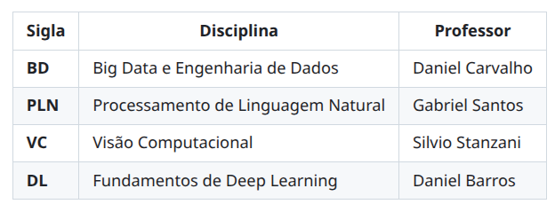
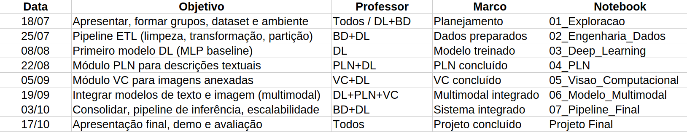

## 1. Sobre o Projeto

O Projeto Integrador tem como objetivo agregar os conhecimentos desenvolvidos nas disciplinas da Pós-Graduação em Inteligência Artificial por meio da construção de uma solução baseada em Inteligência Artificial aplicada a um problema real.

Durante o semestre, os estudantes desenvolverão incrementalmente um **Sistema Inteligente Multimodal para Análise Automática de Chamados e Evidências**, explorando conceitos de *Big Data e Engenharia de Dados*, *Processamento de Linguagem Natural*, *Visão Computacional*, e *Deep Learning*.

Todo o desenvolvimento deverá ser realizado em equipes utilizando GitHub como ferramenta de gerenciamento do projeto.

### 

|  |  |
|------------|---------|
| **Disciplina**: | Projeto Integrador II: Aplicação de Deep Learning |
| **Curso**: | Pós-Graduação em Inteligência Artificial |
| **Instituição**: | PUC-SP |
| **Carga horária**: | 40 horas |
| **Equipe**: | 1 a 4 alunos |
| **Repositório**: | Código versionado no GitHub |
| **Ferramentas**: | Python, Jupyter, TensorFlow, Scikit-learn |
| **Entrega final**: | Apresentação do projeto + código documentado |

---

## 2. Objetivos

### 2.1. Objetivos de Aprendizagem

Ao final do Projeto Integrador espera-se que os estudantes sejam capazes de:

1. Trabalhar em equipes utilizando GitHub;
2. Desenvolver pipelines de Big Data e Engenharia de Dados;
3. Aplicar técnicas modernas de Processamento de Linguagem Natural;
4. Desenvolver modelos de Visão Computacional;
5. Construir modelos de Deep Learning;
6. Integrar diferentes modalidades de dados em um único sistema inteligente;
7. Documentar adequadamente um projeto de IA;
8. Apresentar tecnicamente uma solução completa.

### 2.2. Objetivos Pedagógicos

Ao final do projeto espera-se que os estudantes sejam capazes de:

- Desenvolver soluções reais utilizando IA;
- Integrar diferentes áreas da Inteligência Artificial;
- Trabalhar colaborativamente em equipes;
- Organizar projetos utilizando Git e GitHub;
- Documentar adequadamente seus experimentos;
- Apresentar resultados técnicos de forma clara e objetiva.

---

## 3. Disciplinas Envolvidas



---

## 4. Tema do Projeto

### Sistema Inteligente Multimodal para Análise Automática de Chamados e Evidências

Imagine uma empresa que recebe milhares de chamados contendo:

- descrição textual;
- imagens anexadas;
- dados históricos;
- informações do cliente;
- informações operacionais.

O objetivo é desenvolver um sistema capaz de:

- compreender o texto;
- analisar as imagens;
- combinar diferentes modalidades de dados;
- classificar automaticamente o chamado;
- sugerir prioridade;
- auxiliar o processo de atendimento.

---

## 5. Arquitetura Geral


---

## 6. Organização entre os Professores

Cada professor permanece responsável pelos conteúdos da sua disciplina.

O Projeto Integrador não substitui as disciplinas individuais, mas fornece um problema comum que será desenvolvido incrementalmente ao longo do semestre.

Espera-se que cada disciplina produza um componente que será incorporado ao sistema final.

Recomenda-se que os professores mantenham reuniões rápidas de alinhamento sempre que necessário para acompanhar a evolução dos grupos e garantir a integração entre as etapas.

---

## 7. Cronograma

O Projeto Integrador será desenvolvido ao longo de **8 encontros remotos síncronos**, acompanhando a evolução das disciplinas participantes. A cada aula, os estudantes desenvolverão uma nova etapa da solução, construindo incrementalmente um **Sistema Inteligente Multimodal para Análise Automática de Chamados e Evidências**.

Todos os grupos utilizarão o **mesmo [dataset](/materiais/dataset/README.md) oficial**, definido pelos professores no início do semestre.

### 7.1. Cronograma das Aulas



| Data | Objetivo | Professor(es) | Marco | Notebook |
|:----------:|------------------|---------------|------------------|-------------------|
| **18/07** | Apresentar, formar grupos, dataset e ambiente. | Todos / **DL+BD** | Planejamento | **01_Exploracao** |
| **25/07** | Pipeline ETL (limpeza, transformação, partição). | **BD+DL** | Dados preparados | **02_Engenharia_Dados** |
| **08/08** | Primeiro modelo DL (MLP baseline). | **DL** | Modelo treinado | **03_Deep_Learning** |
| **22/08** | Módulo PLN para descrições textuais. | **PLN+DL** | PLN concluído | **04_PLN** |
| **05/09** | Módulo VC para imagens anexadas. | **VC+DL** | VC concluído | **05_Visao_Computacional** |
| **19/09** | Integrar modelos de texto e imagem (multimodal). | **DL+PLN+VC** | Multimodal integrado | **06_Modelo_Multimodal** |
| **03/10** | Consolidar, pipeline de inferência, escalabilidade. | **BD+DL** | Sistema integrado | **07_Pipeline_Final** |
| **17/10** | Apresentação final, demo e avaliação. | **Todos** | Projeto concluído | **Projeto Final** |

### 7.2. Entregas Esperadas

Cada notebook representa uma etapa incremental da construção da solução. Ao final do semestre, todos os notebooks deverão compor um único repositório GitHub organizado, documentado e reproduzível.

| Notebook | Objetivo | Competências | Conteúdo |
|----------|----------|----------------------------|-------------------|
| **01_Exploracao** | Planejar e<br>compreender o<br>problema. | Planejamento, trabalho em equipe, EDA e arquitetura. | Descrição, [dataset](/materiais/dataset/README.md), EDA, arquitetura inicial e planejamento. |
| **02_Engenharia_Dados** | Preparar dados<br>para os modelos. | Engenharia de Dados, ETL e preparação. | Ingestão, limpeza, transformação, partição treino/validação/teste e documentação. |
| **03_Deep_Learning** | Desenvolver o<br>primeiro modelo DL. | Redes neurais, treino supervisionado, avaliação. | MLP baseline, treino, ajuste de hiperparâmetros, avaliação e discussão. |
| **04_PLN** | Desenvolver o<br>módulo PLN. | Pré‑processamento de textos, embeddings, classificação. | Limpeza, embeddings, treino do modelo PLN, avaliação. |
| **05_Visao_Computacional** | Desenvolver o<br>módulo VC. | Processamento de imagens, CNNs, Transfer Learning. | Preparação das imagens, CNN/Transfer Learning, avaliação. |
| **06_Modelo_Multimodal** | Integrar texto e<br>imagem em uma<br>solução única. | Modelagem multimodal, fusão de embeddings, comparação. | Early/Late Fusion, treino multimodal, avaliação comparativa e discussão. |
| **07_Pipeline_Final** | Consolidar a<br>solução do grupo. | Engenharia de IA, pipelines, documentação, implantação. | Pipeline de inferência, organização, documentação, avaliação final e limitações. |
| **Projeto Final** | Apresentar e<br>defender a<br>solução. | Comunicação técnica, integração, colaboração, apresentação. | Repositório, notebooks, relatório técnico (2p), apresentação (15 min) e demo. |

---

## 8. Produto Final

Cada grupo deverá entregar:

- Repositório GitHub organizado;
- Todos os notebooks desenvolvidos;
- Relatório técnico (até 2 páginas);
- Apresentação final (15 minutos);
- Demonstração da solução.

---

## 9. Critérios de Avaliação

| Critério | Disciplina Relacionada | Peso |
|----------|------------------------|:----:|
| Pipeline de Big Data e Engenharia de Dados | BD | 15% |
| Modelo de Deep Learning | DL | 20% |
| Modelo de Processamento de Linguagem Natural | PLN | 15% |
| Modelo de Visão Computacional | VC | 15% |
| Modelo Multimodal Integrado | Transversal | 20% |
| Organização do GitHub e Documentação | Transversal | 5% |
| Relatório Técnico | Transversal | 5% |
| Apresentação oral e defesa do Projeto | Transversal | 5% |
| **Total** | | **100%** |

### Nota mínima para aprovação

De acordo com o regulamento do curso, o aluno deverá obter nota mínima de 7,0 (sete) no Projeto Integrador para aprovação no Módulo I. Frequência mínima exigida: 75%.

---

## 10. Tecnologias Sugeridas

- Git
- GitHub
- Python
- Jupyter Notebook
- Pandas
- NumPy
- Scikit-Learn
- TensorFlow
- Hugging Face Transformers
- OpenCV
- Apache Spark

---

## 11. Estrutura Esperada dos Repositórios dos Grupos

```
grupo-XX/
├── README.md
├── notebooks/
│   ├── 01_Exploracao.ipynb
│   ├── 02_Engenharia_Dados.ipynb
│   ├── 03_Deep_Learning.ipynb
│   ├── 04_PLN.ipynb
│   ├── 05_Visao_Computacional.ipynb
│   ├── 06_Modelo_Multimodal.ipynb
│   └── 07_Pipeline_Final.ipynb
├── models/
├── reports/
├── presentation/
├── src/
│   ├── data_loader.py
│   ├── preprocessing.py
│   ├── models.py
│   └── utils.py
├── requirements.txt
└── .gitignore
```

---

## 12. Organização do Projeto

Cada grupo deverá utilizar GitHub durante todo o desenvolvimento.

Recomenda-se:

- Utilização de Issues para gerenciamento de tarefas;
- Utilização de Pull Requests para revisão de código;
- Commits frequentes com mensagens descritivas;
- Documentação contínua do progresso;
- Versionamento adequado dos notebooks.

---

## 13. Considerações Finais e Ética

O desenvolvimento deste projeto deve considerar aspectos éticos importantes:

- **Privacidade**: Serão utilizados exclusivamente dados sintéticos ou anonimizados. Nenhum dado pessoal ou sensível será processado.
- **Viés algorítmico**: Os modelos serão avaliados quanto a possíveis vieses que possam impactar negativamente grupos específicos.
- **Transparência**: Todo o código, dados e metodologia estarão disponíveis publicamente no GitHub, garantindo reprodutibilidade.
- **Finalidade**: O projeto tem fins exclusivamente acadêmicos e visa contribuir para o aprendizado e desenvolvimento de habilidades em IA.

---

## 14. FAQ

### Podemos utilizar TensorFlow?

Sim.

### Podemos utilizar PyTorch?

Sim.

### Podemos utilizar outros modelos além dos apresentados em aula?

Sim, desde que devidamente documentados.

### Podemos utilizar bibliotecas adicionais?

Sim.

### Podemos utilizar Inteligência Artificial Generativa?

Sim, desde que o uso seja informado e documentado no relatório técnico.

### Podemos utilizar outro dataset?

Não. Todos os grupos deverão utilizar o dataset oficial disponibilizado pelos professores.

---

## 15. Referências Bibliográficas

[1] GÉRON, Aurélien. *Hands-On Machine Learning with Scikit-Learn, Keras & TensorFlow*. 2. ed. Sebastopol: O'Reilly Media, 2019.

[2] MÜELLER, Andreas C.; GUIDO, Sarah. *Introduction to Machine Learning with Python: A Guide for Data Scientists*. Sebastopol: O'Reilly Media, 2016.

[3] MCKINNEY, Wes. *Python for Data Analysis: Data Wrangling with Pandas, NumPy, and IPython*. 2. ed. Sebastopol: O'Reilly Media, 2017.

[4] CHOLLET, François. *Deep Learning with Python*. 2. ed. Nova York: Manning Publications, 2021.

[5] BURKOV, Andriy. *The Hundred-Page Machine Learning Book*. Trois-Rivières: Burkov, 2019.

[6] HASTIE, Trevor; TIBSHIRANI, Robert; FRIEDMAN, Jerome. *The Elements of Statistical Learning*. 2. ed. Nova York: Springer, 2009.

[7] VASWANI, Ashish et al. "Attention Is All You Need". In: *Advances in Neural Information Processing Systems*, 2017.

[8] LAKSHMANAN, V.; ROBINSON, S.; MUNN, M. *Machine Learning Design Patterns*. Sebastopol: O'Reilly Media, 2020.

[9] PEDREGOSA, F. et al. Scikit-learn: Machine Learning in Python. *Journal of Machine Learning Research*, v. 12, p. 2825–2830, 2011.

[10] ABADI, Martín et al. TensorFlow: A System for Large-Scale Machine Learning. In: *12th USENIX Symposium on Operating Systems Design and Implementation*, 2016.

---
